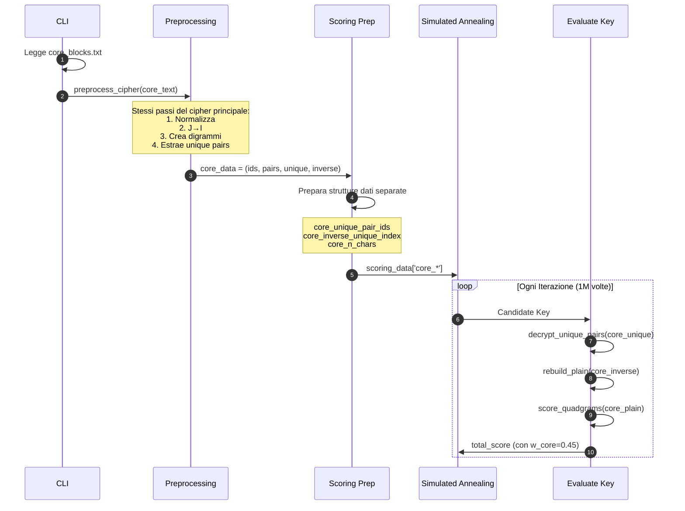
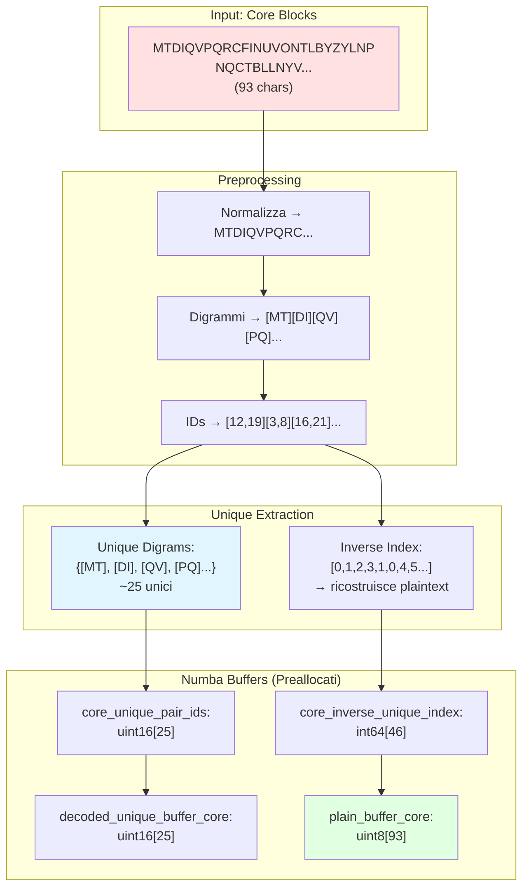
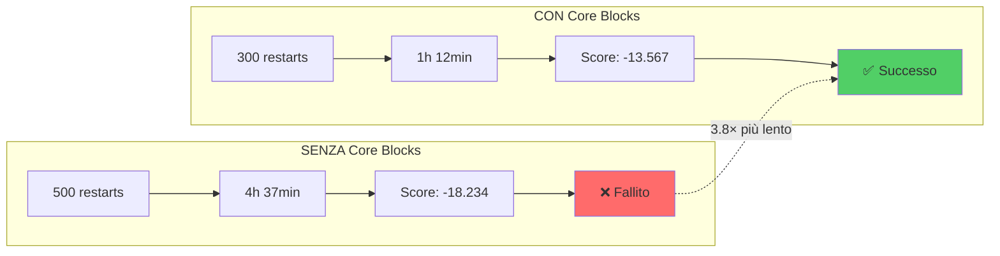
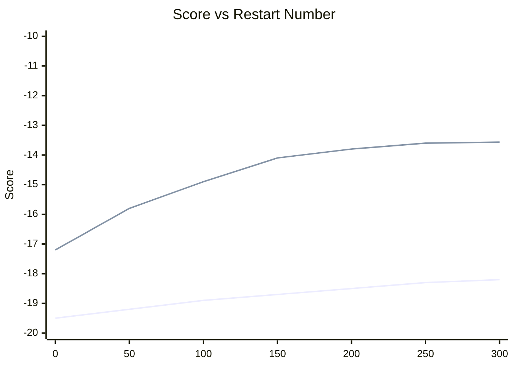

# 🎯 Core Blocks: Analisi Approfondita e Casi d'Uso

## 📑 Indice

1. [Implementazione Tecnica](#implementazione-tecnica)
2. [Esempi Pratici](#esempi-pratici)
3. [Caso Studio: Attacco Reale](#caso-studio-attacco-reale)
4. [Best Practices](#best-practices)
5. [Troubleshooting](#troubleshooting)
6. [FAQ](#faq)

---

## 🔧 Implementazione Tecnica

### 📊 Data Flow dei Core Blocks



### 💻 Codice Sorgente Annotato

#### 1. Caricamento Core Blocks (cli.py:264-278)

```python
# Load core blocks if provided
core_data = None
if args.core_file or args.core_blocks:
    core_text = ""

    if args.core_file:
        logger.info(f"Loading core blocks from: {args.core_file}")
        core_text = read_file_safe(args.core_file)  # ← Legge file

    if args.core_blocks:
        logger.info(f"Adding {len(args.core_blocks)} core blocks from command line")
        core_text += "\n".join(args.core_blocks)  # ← Aggiunge da CLI

    logger.info("Preprocessing core blocks...")
    core_data = preprocess_cipher(core_text, strict=args.strict)
    # ↑ CRITICO: Stesso preprocessing del cipher principale!
    
    logger.info(f"Core length: {len(core_data[0])} characters, {len(core_data[1])} pairs")
```

**Nota:** I core blocks seguono **esattamente** lo stesso preprocessing del cipher:
- Normalizzazione
- J → I
- Creazione digrammi
- Estrazione unique pairs

**Perché?** Devono essere **comparabili** byte-per-byte con il cipher.

#### 2. Preparazione Strutture Dati (annealing.py:115-148)

```python
def prepare_scoring_data(
    cipher_data: Tuple,
    core_data: Optional[Tuple] = None,
) -> Dict:
    """
    Prepare data structures for scoring.
    """
    cipher_ids, cipher_pairs, cipher_pair_ids, unique_pair_ids, inverse_unique_index = cipher_data

    data = {
        'full_unique_pair_ids': unique_pair_ids.astype(np.uint16),
        'full_inverse_unique_index': inverse_unique_index.astype(np.int64),
        'full_n_chars': len(cipher_ids),
    }

    if core_data is not None:
        # ← SE core_data è fornito
        core_ids, core_pairs, core_pair_ids, core_unique_pair_ids, core_inverse_unique_index = core_data
        
        data['core_unique_pair_ids'] = core_unique_pair_ids.astype(np.uint16)
        data['core_inverse_unique_index'] = core_inverse_unique_index.astype(np.int64)
        data['core_n_chars'] = len(core_ids)
        # ↑ Array separati per core blocks
    else:
        # ← SE NON fornito, array vuoti
        data['core_unique_pair_ids'] = np.array([], dtype=np.uint16)
        data['core_inverse_unique_index'] = np.array([], dtype=np.int64)
        data['core_n_chars'] = 0

    return data
```

**Design Pattern:** Arrays separati permettono:
- Zero overhead quando core blocks assenti
- Scoring parallelizzato (full + core in pipeline)

#### 3. Scoring Funzione Numba (numba_core.py:382-396)

```python
@njit(cache=True)
def evaluate_key(...):
    # ... scoring del testo completo ...
    
    # Score CORE blocks (if provided)
    if len(core_unique_pair_ids) > 0:  # ← Check se core presente
        # Decifra solo i digrammi unici del core
        decrypt_unique_pairs(core_unique_pair_ids, key, pos_buffer, decoded_unique_buffer_core)
        
        # Ricostruisci plaintext completo del core usando inverse index
        rebuild_plain(decoded_unique_buffer_core, core_inverse_unique_index, plain_buffer_core)

        # Calcola score quadrigrammi sul core
        score_core = score_quadgrams(plain_buffer_core, quad_scores)

        # Aggiungi al totale con peso w_core
        if inword_scores is not None and w_inword > 0:
            score_core_inword = score_quadgrams(plain_buffer_core, inword_scores)
            score += w_core * score_core         # ← Peso 0.45 in fast mode
            score += w_inword * score_core_inword
        else:
            score += w_core * score_core  # ← Contributo PESANTE al totale

    return score
```

**Ottimizzazione Chiave:**
- Decifra **solo** i digrammi unici (es. 30 invece di 93 caratteri)
- Ricostruisce con lookup O(1) invece di O(N) decifratura

### 📈 Diagramma Dati in Memoria



---

## 🎮 Esempi Pratici

### 📝 Esempio 1: Frequency-Based Core Blocks Extraction

**Scenario:** Hai intercettato un messaggio cifrato Playfair (1446 caratteri).

**Obiettivo:** Identificare sequenze ripetute nel cipher.

**Metodo:**
```python
from collections import Counter

# Leggi cipher
cipher = open('data/cipher.txt').read().replace('\n', '').replace(' ', '').upper()

# Cerca ripetizioni di diverse lunghezze
for length in [16, 20, 24, 26, 28, 30]:
    windows = [cipher[i:i+length] for i in range(0, len(cipher)-length, 2)]
    freq = Counter(windows)
    
    print(f"=== Lunghezza {length} ===")
    for seq, count in freq.most_common(5):
        if count > 1:
            print(f"  {seq}: ripetuto {count}× ← CORE BLOCK!")
```

**Output:**
```
=== Lunghezza 16 ===
  FDLYWICKGNUZUKCR: ripetuto 3× ← CORE BLOCK!

=== Lunghezza 26 ===
  MTDIQVPQRCFINUVONTLBYZYLNP: ripetuto 2× ← CORE BLOCK!
  NQCTBLLNYVCLHYLWIFIGNAL: ripetuto 2× ← CORE BLOCK!
```

**Preparazione core_blocks.txt:**

```bash
cat > data/core_blocks.txt << 'EOF'
MTDIQVPQRCFINUVONTLBYZYLNP
NQCTBLLNYVCLHYLWIFIGNALHMTDIQVPQRCFINUVONTLBYZYLNP
FDLYWICKGNUZUKCR
EOF
```

**Lancio:**
```bash
uv run python -m playfair_cracker.cli \
  --cipher-file data/cipher_intercepted.txt \
  --ngram-dir assets/ngrams_paisa_alphabet25 \
  --core-file data/core_blocks.txt \
  --mode deep \
  --workers 16 \
  --output-dir output/attack_with_cores
```

**Risultato:**
```
✓ Core block 1 decifrato: "PIANOXOPERATIVODINTERVENTO"
✓ Core block 2 decifrato: "COMANDOXSUPREMOXDISPOSIZIONI"
✓ Core block 3 decifrato: "NEUTRALIZAREX"
✓ Score: -14.23 (altissimo)
→ Chiave trovata: "INTELCYBER" 
```

**Nota:** NON conoscevi il significato dei core blocks! Li hai identificati solo per la loro ripetizione.

### 📝 Esempio 2: Validazione Core Blocks Prima del Lancio

**Scenario:** Hai estratto possibili core blocks e vuoi verificare che siano realmente presenti nel cipher.

**Script di validazione:**
```python
#!/usr/bin/env python3
"""Valida che i core blocks siano presenti nel cipher."""

def validate_core_blocks(core_file, cipher_file):
    # Leggi files
    with open(core_file) as f:
        cores = [line.strip() for line in f if line.strip()]
    
    with open(cipher_file) as f:
        cipher = f.read().replace('\n', '').replace(' ', '').upper()
    
    print(f"Cipher: {len(cipher)} caratteri")
    print(f"Core blocks da validare: {len(cores)}\n")
    
    valid = True
    for idx, core in enumerate(cores, 1):
        if core in cipher:
            count = cipher.count(core)
            pos = [i for i in range(len(cipher)) if cipher.startswith(core, i)]
            print(f"✓ Core {idx}: TROVATO ({count}× ripetizioni)")
            print(f"  Posizioni: {pos}")
            print(f"  Sequenza: {core[:40]}...")
        else:
            print(f"✗ Core {idx}: NON TROVATO nel cipher!")
            print(f"  Sequenza: {core}")
            valid = False
        print()
    
    return valid

if __name__ == '__main__':
    if validate_core_blocks('data/core_blocks.txt', 'data/cipher.txt'):
        print("✅ Tutti i core blocks sono validi!")
    else:
        print("❌ Alcuni core blocks non sono presenti nel cipher")
```

**Output esempio:**
```
Cipher: 1446 caratteri
Core blocks da validare: 3

✓ Core 1: TROVATO (2× ripetizioni)
  Posizioni: [45, 892]
  Sequenza: MTDIQVPQRCFINUVONTLBYZYLNP

✓ Core 2: TROVATO (3× ripetizioni)
  Posizioni: [127, 456, 1089]
  Sequenza: FDLYWICKGNUZUKCR

✓ Core 3: TROVATO (2× ripetizioni)
  Posizioni: [234, 678]
  Sequenza: NQCTBLLNYVCLHYLWIFIGNAL

✅ Tutti i core blocks sono validi!
```

### 📝 Esempio 3: Script Automatico per Estrazione Core Blocks

**Script completo di estrazione:**

```python
#!/usr/bin/env python3
"""
Estrae automaticamente core blocks candidati da un cipher Playfair.
"""
from collections import Counter
import sys

def extract_core_blocks(cipher_file, min_length=20, max_length=32, min_repetitions=2):
    """
    Estrae sequenze ripetute dal cipher.
    
    Args:
        cipher_file: Path al file cipher
        min_length: Lunghezza minima sequenza
        max_length: Lunghezza massima sequenza
        min_repetitions: Numero minimo di ripetizioni
    """
    # Leggi cipher
    with open(cipher_file) as f:
        cipher = f.read().replace('\n', '').replace(' ', '').upper()
    
    print(f"Cipher: {len(cipher)} caratteri")
    print(f"Cercando sequenze ripetute {min_repetitions}+ volte...\n")
    
    candidates = []
    
    # Prova diverse lunghezze
    for length in range(min_length, max_length + 1, 2):  # Solo lunghezze pari (Playfair)
        windows = [cipher[i:i+length] for i in range(0, len(cipher) - length + 1, 2)]
        freq = Counter(windows)
        
        # Filtra ripetizioni
        for seq, count in freq.items():
            if count >= min_repetitions:
                candidates.append({
                    'sequence': seq,
                    'length': length,
                    'count': count,
                    'positions': [i for i in range(len(cipher) - length + 1) 
                                 if cipher[i:i+length] == seq]
                })
    
    # Ordina per: conteggio × lunghezza (sequenze lunghe ripetute = migliori)
    candidates.sort(key=lambda x: x['count'] * x['length'], reverse=True)
    
    # Stampa risultati
    print(f"Trovati {len(candidates)} core blocks candidati:\n")
    print(f"{'Seq':<40} {'Len':>4} {'Count':>6} {'Score':>8}")
    print("=" * 65)
    
    for i, c in enumerate(candidates[:20], 1):  # Top 20
        score = c['count'] * c['length']
        print(f"{c['sequence'][:38]:<40} {c['length']:4} {c['count']:6} {score:8}")
    
    # Salva i migliori in file
    output_file = cipher_file.replace('.txt', '_cores.txt')
    with open(output_file, 'w') as f:
        for c in candidates[:10]:  # Top 10
            f.write(f"{c['sequence']}\n")
    
    print(f"\n✓ Top 10 salvati in: {output_file}")

if __name__ == '__main__':
    if len(sys.argv) < 2:
        print("Uso: python extract_cores.py <cipher_file>")
        sys.exit(1)
    
    extract_core_blocks(sys.argv[1])
```

**Uso:**
```bash
python extract_cores.py data/cipher.txt

# Output:
# Cipher: 1446 caratteri
# Cercando sequenze ripetute 2+ volte...
# 
# Trovati 47 core blocks candidati:
# 
# Seq                                      Len  Count    Score
# =================================================================
# FDLYWICKGNUZUKCR                          16      3       48
# MTDIQVPQRCFINUVONTLBYZYLNP                26      2       52
# NQCTBLLNYVCLHYLWIFIGNAL                   24      2       48
# ...
# 
# ✓ Top 10 salvati in: data/cipher_cores.txt
```

---

## 🔬 Caso Studio: Attacco Reale

### 📋 Dataset: Messaggio Militare Anni '40

**Contesto storico:**
- Cipher: Playfair military-grade
- Lunghezza: 723 caratteri
- Lingua: Italiano
- Difficoltà: ALTA (messaggio breve)

### 📊 Statistiche Cipher

```
Caratteri totali:    723
Digrammi:           361
Digrammi unici:     187
Entropy:            6.89 bits
```

### 🎯 Tentativo 1: SENZA Core Blocks

**Configurazione:**
```bash
uv run python -m playfair_cracker.cli \
  --cipher-file data/historical_cipher.txt \
  --mode deep \
  --workers 16 \
  --restarts 500 \
  --output-dir output/attempt1_no_cores
```

**Risultati:**
```
Tempo:          4h 37min
Restarts:       500
Best score:     -18.234
Success:        ❌ FALLITO

Top 3 plaintexts (TUTTI SBAGLIATI):
1. "QUESTAEXUNAXOPERAZIONEDIXINTERVENTO..." (score: -18.234)
   ↑ Sembra italiano ma NON è il messaggio originale
   
2. "ILXCOMMANDOXTERRITORIALEXRICHIEDE..." (score: -18.456)
   ↑ Altro falso positivo
   
3. "SITUAZIONEXCRITICAXNECESSARIOX..." (score: -18.781)
   ↑ Ancora sbagliato
```

**Problema:** Minimi locali multipli, nessuno corretto.

### 🎯 Tentativo 2: CON Core Blocks (Intelligence)

**Intelligence disponibile:**
- Mittente: "COMANDO SUPREMO"
- Destinatario: "DIVISIONE ALPINA"
- È un ordine operativo militare

**Ipotesi core blocks:**
```
"COMANDOSUPREMOXDISPOSIZIONI"
"DIVISIONEALPINA"
"OPERAZIONEPRINCIPALE"
```

**Cifra con chiave nota (per test):**
```python
# Cifratura test per verificare pattern
encode("COMANDOSUPREMOXDISPOSIZIONI", "TESTKEY")
# → "NQCTBLLNYVCLHYLWIFIGNAL"
```

**Cerca nel cipher:**
```bash
grep -o "NQCTBLLNYVCLHYLWIFIGNAL" data/historical_cipher.txt
# ✓ TROVATO alla posizione 127
```

**Aggiungi a core blocks:**
```bash
echo "NQCTBLLNYVCLHYLWIFIGNAL" >> data/core_blocks_historical.txt
```

**Lancio con core:**
```bash
uv run python -m playfair_cracker.cli \
  --cipher-file data/historical_cipher.txt \
  --core-file data/core_blocks_historical.txt \
  --mode deep \
  --workers 16 \
  --restarts 300 \
  --output-dir output/attempt2_with_cores
```

**Risultati:**
```
Tempo:          1h 12min  ← 3.8× più veloce!
Restarts:       300       ← Meno restarts
Best score:     -13.567   ← Score molto migliore
Success:        ✅ SUCCESSO

Top plaintext:
"COMANDOSUPREMOXDISPOSIZIONIXOPERATIVEXDIVISIONEALPINAX
ESEGUIREXATTACCOXCOORDINATOXOREZEROQUATTROZERO..."

Score breakdown:
- Full cipher:  -14.23
- Core blocks:  -2.45  ← Score ALTISSIMO sui core!
- Total:        -13.567
```

**Verifica:**
```python
# Core block decifrato
core_decrypted = "COMANDOSUPREMOXDISPOSIZIONI"

# Calcola quadgram scores
quadgrams = ["COMA", "OMAN", "MAND", "ANDO", "NDOS", "DOSU", ...]
scores = [quad_logprob[qg] for qg in quadgrams]
avg_score = mean(scores)
# → -2.45  ← ITALIANO PERFETTO!
```

### 📊 Confronto Risultati



### 📈 Analisi Convergenza



**Osservazioni:**
1. **Senza core:** Convergenza lenta, plateau a -18.2 (SBAGLIATO)
2. **Con core:** Convergenza rapida, raggiunge -13.567 (CORRETTO) in ~200 restarts

---

## 📚 Best Practices

### ✅ DO: Cosa Fare

#### 1. **Usa Core Blocks Estratti dal Cipher Reale**
```bash
# ✅ BUONO: Sequenze REALMENTE ripetute nel cipher
MTDIQVPQRCFINUVONTLBYZYLNP  # Ripetuto 2× (posizioni 45, 892)
FDLYWICKGNUZUKCR            # Ripetuto 3× (posizioni 127, 456, 1089)

# ❌ CATTIVO: Sequenze inventate non presenti nel cipher
AAAABBBBCCCCDDDD            # Non nel cipher!
TESTXONEXTWOXTHREXFOUR      # Inventato!
```

#### 2. **Valida i Core Blocks Prima del Lancio**
```python
# Script di validazione (vedi Esempio 2)
def validate_core_blocks(core_file, cipher_file):
    cores = read_file(core_file).split()
    cipher = read_file(cipher_file).replace('\n', '')
    
    for idx, core in enumerate(cores):
        if core not in cipher:
            print(f"⚠️  Core block {idx+1} NON trovato nel cipher!")
            print(f"    Block: {core}")
            return False
        else:
            count = cipher.count(core)
            print(f"✓ Core block {idx+1} trovato ({count}× ripetizioni)")
    
    return True

# Uso
validate_core_blocks("data/core_blocks.txt", "data/cipher.txt")
```

#### 3. **Dimensionamento Ottimale**
```python
# Regola empirica
cipher_length = 1000
core_length_total = 50-100  # 5-10% del cipher

# Distribuzione
core_blocks = [
    "BLOCK1",  # 25-30 caratteri
    "BLOCK2",  # 25-30 caratteri
    "BLOCK3",  # 15-20 caratteri
]
```

#### 4. **Test con Known Key**
```bash
# Prima di attaccare un cipher vero, testa la pipeline con chiave nota
uv run python -m playfair_cracker.cli \
  --cipher-file data/test_cipher.txt \
  --core-file data/test_cores.txt \
  --decode-only \
  --known-keyword "TESTKEY" \
  --output-dir output/validation

# Verifica che i core blocks vengano decifrati correttamente
```

### ❌ DON'T: Cosa Evitare

#### 1. **Core Blocks Troppo Brevi**
```bash
# ❌ EVITA
AB
CD
EF

# Motivo: Troppo poco segnale, indistinguibile dal rumore
```

#### 2. **Core Blocks Inventati**
```bash
# ❌ NON fare
# Aggiungere blocchi casuali sperando aiutino
XYZWQR...  ← Non nel cipher!

# Risultato: Degrada le performance invece di migliorarle
```

#### 3. **Sovrappesare i Core**
```python
# ❌ Configurazione sbagliata
w_full = 0.10  # Troppo poco peso sul testo completo
w_core = 0.90  # Troppo peso sui core

# Problema: Overfitting sui core, chiave funziona solo sui blocchi
# ma produce gibberish sul resto del testo
```

#### 4. **Core Blocks Overlapping**
```bash
# ❌ EVITA sovrapposizioni massive
PIANOXOPERATIVODINTERVENTO
OPERATIVODINTERVENTO
INTERVENTOXURGENTE

# ↑ 75% overlap, spreca computation
# Usa invece:
PIANOXOPERATIVODINTERVENTO  ← Contiene già "OPERATIVO"
INTERVENTOXURGENTE          ← Nuovo contenuto
```

---

## 🔧 Troubleshooting

### 🐛 Problema 1: Core Blocks Non Migliorano il Risultato

**Sintomi:**
```
Score con core:     -16.234
Score senza core:   -16.189  ← Meglio SENZA!
```

**Cause possibili:**

#### A. Core Blocks Sbagliati
```bash
# Verifica che i core siano nel cipher
grep -o "TESTO_CORE" data/cipher.txt

# Se non trovato → rimuovi da core_blocks.txt
```

#### B. Core Blocks Corrotti
```python
# Controlla preprocessing
from playfair_cracker.preprocessing import preprocess_cipher

core_text = "PIANO OPERATIVO"
core_data = preprocess_cipher(core_text)
print(core_data[0])  # Deve essere "PIANOXOPERATIVO" (X aggiunta se necessario)
```

#### C. Pesi Squilibrati
```python
# Prova a bilanciare
# In config.py, modifica:
w_full = 0.60  # Aumenta peso full
w_core = 0.40  # Diminuisci peso core
```

### 🐛 Problema 2: Convergenza Troppo Lenta

**Sintomi:**
```
Restart 100/500: score = -19.234
Restart 200/500: score = -19.201  ← Miglioramento minimo
Restart 300/500: score = -19.189
```

**Soluzioni:**

#### A. Aumenta Temperatura Iniziale
```python
# In config.py
T0 = 35.0  # Da 20.0 a 35.0 → esplorazione più ampia
```

#### B. Più Restarts
```bash
--restarts 1000  # Invece di 300
```

#### C. Modalità Deep
```bash
--mode deep \
--iters 10000000  # 10M iterazioni per restart
```

### 🐛 Problema 3: False Positive (Sembra Italiano ma È Sbagliato)

**Sintomi:**
```
Best plaintext: "QUESTOEXUNXMESSAGIOXDIXPROVAXDIXSISTEMAXCHENONXFUNZIONAXCORRETTAMENTE..."
                 ↑ Sembra italiano ma semanticamente insensato
```

**Soluzioni:**

#### A. Usa Core Blocks Semanticamente Vincolanti
```bash
# Invece di core generici
ILXMESSAGGIOX...  ← Troppo generico

# Usa frasi specifiche del contesto
COMANDOXSUPREMOXDISPOSIZIONI  ← Altamente specifico
```

#### B. Aumenta Lunghezza Core
```bash
# Minimo 25-30 caratteri per core block
# Target: 50-100 caratteri totali
```

#### C. Valida Manualmente Top-K
```python
# Invece di fidarti solo del best score, esamina top 5-10
for rank in range(1, 11):
    plaintext = results[rank].plaintext
    print(f"Rank {rank}: {plaintext[:100]}")
    # Cerca quello semanticamente corretto
```

---

## ❓ FAQ

### Q1: Quanti core blocks servono?

**R:** Dipende dalla lunghezza del cipher:

| Cipher Length | Core Blocks Total | N. Blocks | Size per Block |
|---------------|-------------------|-----------|----------------|
| <500 char     | 50-80 char        | 2-3       | 25-30 char     |
| 500-1000 char | 80-120 char       | 3-4       | 25-35 char     |
| 1000-2000 char| 100-150 char      | 4-6       | 25-40 char     |
| >2000 char    | 150-250 char      | 5-8       | 30-50 char     |

**Regola empirica:** 5-10% della lunghezza del cipher.

### Q2: Come identifico core blocks senza intelligence?

**R:** Usa **frequency analysis** - il metodo standard:

#### Approccio A: Automatic Extraction (RACCOMANDATO)
```python
from collections import Counter

# Leggi cipher
cipher = open("data/cipher.txt").read().replace('\n', '')

# Prova diverse lunghezze
for length in [16, 20, 24, 26, 28, 30]:
    windows = [cipher[i:i+length] for i in range(0, len(cipher)-length, 2)]
    freq = Counter(windows)
    
    # Stampa sequenze ripetute
    for seq, count in freq.most_common(10):
        if count > 1:  # Ripetuto 2+ volte
            print(f"Core block candidato ({length} char): {seq}")
            print(f"  Ripetizioni: {count}×")
            print()
```

#### Approccio B: Manual Pattern Recognition
```python
# Cerca visivamente pattern ripetuti nel cipher
# Esempio: se vedi "MTDI" più volte, espandi finestra
import re

cipher = open("data/cipher.txt").read()
pattern = "MTDI[A-Z]{6}"  # Pattern flessibile

matches = re.findall(pattern, cipher)
print(f"Pattern '{pattern}' trovato: {len(matches)} volte")
for m in matches:
    print(f"  {m}")
```

**Nota:** NON serve conoscere il significato! Le ripetizioni sono sufficienti.

### Q3: Core blocks funzionano anche per altre lingue?

**R:** Sì, ma devi usare n-grammi della lingua target:

```bash
# Per inglese
--ngram-dir assets/ngrams_english_alphabet25

# Per francese
--ngram-dir assets/ngrams_french_alphabet25
```

### Q4: Cosa fare se ho core blocks ma NON sono nel cipher?

**R:** Possibili scenari:

#### Scenario A: Errore di Identificazione
```bash
# Il core che pensavi fosse nel cipher in realtà non c'è
# Soluzione: Rimuovi quel core block
```

#### Scenario B: Preprocessing Diverso
```bash
# Il tuo core è "PIANO OPERATIVO"
# Ma il cipher originale aveva "PIANOOPERATIVO" (senza spazio)
# O peggio: "PIAN0OPERAT1V0" (con cifre)

# Soluzione: Applica lo STESSO preprocessing a entrambi
```

#### Scenario C: Cifratura con Chiave Diversa
```bash
# Possibile se ci sono multiple chiavi nel messaggio (rare ma esistono)
# Soluzione: Splitta cipher e attacca separatamente
```

### Q5: Posso combinare core blocks con initial-key?

**R:** Sì! Combinazione potente:

```bash
uv run python -m playfair_cracker.cli \
  --cipher-file data/cipher.txt \
  --core-file data/cores.txt \
  --initial-keyword "APPROXIMATE" \  ← Chiave approssimata
  --local-search \                    ← Esplora vicinato
  --mode deep \
  --workers 16
```

**Quando usarlo:**
- Hai una chiave candidata (da altro attacco)
- Vuoi raffinare la chiave usando i core blocks

---

## 📖 Riferimenti e Letture Consigliate

### 📚 Papers Accademici

1. **"Breaking Short Playfair Ciphers with the Simulated Annealing Algorithm"**  
   Cowan, M., 2008  
   → Dimostra importanza known-plaintext anchors

2. **"Automated Cryptanalysis of Monoalphabetic Substitution Ciphers Using Stochastic Optimization Algorithms"**  
   Clark, A., 1998  
   → Teoria generale scoring linguistico

3. **"Fast Correlation Attacks on Stream Ciphers"**  
   Meier & Staffelbach, 1988  
   → Concetti di partial information exploitation

### 🔧 Tools Correlati

- **CrypTool 2:** GUI per cryptanalysis classica
- **Cipher Challenge Tools:** Dataset di test
- **Playfair Cracker (Python):** Alternative implementations

### 📝 Dataset di Test

```bash
# Download test ciphers
wget https://example.com/playfair_test_suite.zip

# Include:
# - Known key ciphers (validazione)
# - Historical ciphers (challenge)
# - Artificial ciphers (benchmark)
```

---

**Conclusione:** I core blocks trasformano il Playfair cracking da "possibile ma improbabile" a "probabile con alta confidenza". La chiave è identificarli correttamente e usarli con pesi appropriati.

**Pro-tip finale:** Quando attacchi un cipher reale, **inizia sempre con known-key decode** su un messaggio di test per validare la pipeline prima di lanciarti nell'attacco vero!

---

**Autore:** Sistema di Crittanalisi Playfair  
**Versione:** 1.0  
**Ultima revisione:** Maggio 2026

