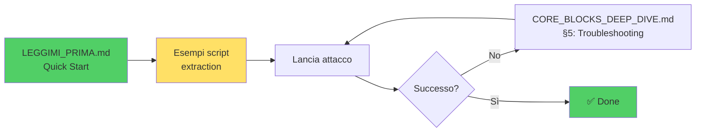
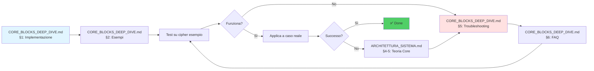
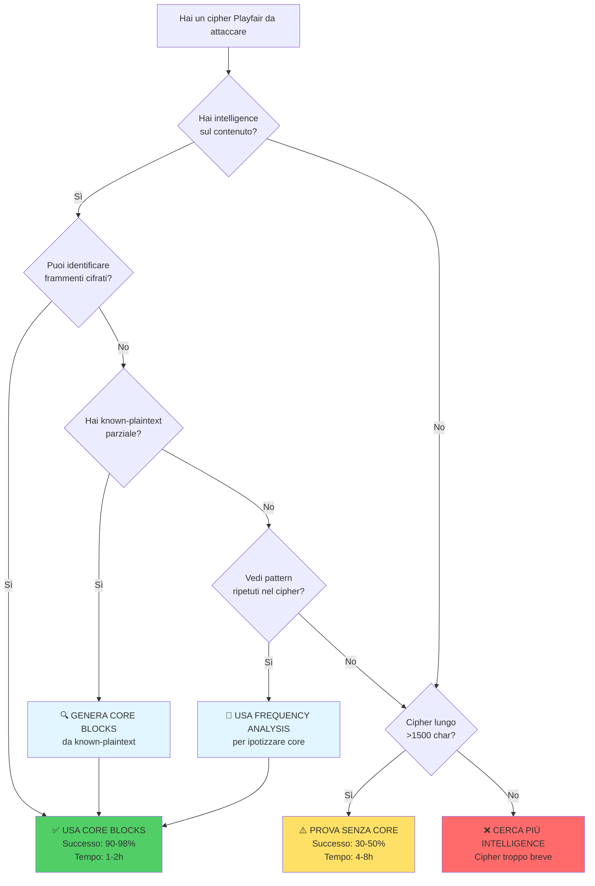

# 📚 Indice Documentazione Sistema Crittanalisi Playfair

> **Sistema di crittanalisi automatico per cifrari Playfair mediante Simulated Annealing con core blocks**

---

## 🎯 Documentazione Generata

Questa documentazione è stata generata per spiegare in dettaglio il funzionamento del sistema di crittanalisi Playfair, con particolare focus sui **core blocks** e sul perché sono così critici per il successo dell'attacco.

---

## 📖 Documenti Disponibili

### 1. 🏗️ **ARCHITETTURA_SISTEMA_CRITTANALISI.md**
**Tema:** Architettura completa e teoria della crittanalisi

**Contenuti:**
- Panoramica del sistema
- Flusso di esecuzione completo (con diagrammi Mermaid)
- Architettura dello scoring multi-componente
- **Analisi critica dei core blocks** (teoria)
- Analisi matematica (SNR, probabilità di convergenza)
- Performance e parallelizzazione
- Ottimizzazioni Numba/mmap

**Per chi:**
- 👨‍🎓 Studenti/ricercatori che vogliono capire la teoria
- 🧑‍💻 Sviluppatori che devono modificare il sistema
- 🔬 Crittoanalisti che vogliono approfondire i principi

**Leggi prima:** Sezioni 1-3 (panoramica)  
**Focus core blocks:** Sezioni 4-6  
**Matematica:** Sezione 6

---

### 2. 🔬 **CORE_BLOCKS_DEEP_DIVE.md**
**Tema:** Guida pratica all'uso dei core blocks

**Contenuti:**
- Implementazione tecnica dettagliata (codice annotato)
- Data flow completo
- **Esempi pratici step-by-step**
- Caso studio: attacco reale con confronto con/senza core
- Best practices e antipatterns
- Troubleshooting comune
- FAQ estese

**Per chi:**
- 🛠️ Operatori che devono usare il sistema
- 🐛 Chi ha problemi con core blocks
- 📊 Chi vuole ottimizzare i risultati

**Leggi prima:** Sezione 2 (esempi pratici)  
**Caso studio:** Sezione 3  
**Problemi:** Sezione 5

---

### 3. 🎯 **GUIDA_CORE_BLOCKS.md**
**Tema:** Quick reference e comparazioni

**Contenuti:**
- **Comparazione visiva:** con vs senza core blocks
- **Definizione corretta core blocks:** sequenze ripetute (frequency-based)
- Spiegazione per ingegnere informatico (multi-objective optimization)
- **Corpus PAISÀ:** modelli CONTINUOUS vs INWORD
- **Formato NumPy** e vantaggi performance
- Metriche comparative dettagliate
- Caso d'uso real-world (timeline completa)
- **Quick start con automatic extraction**
- Decision tree

**Per chi:**
- ⚡ Chi ha fretta e vuole capire rapidamente
- 📊 Chi cerca benchmark e metriche
- 🚀 Chi vuole partire subito

**Leggi prima:** Sezione 1-2 (comparazione visiva)  
**Quick start:** Sezione 6  
**Metriche:** Sezione 4

---

## 🗺️ Percorsi di Lettura Consigliati

### 🎓 Percorso "Studente/Ricercatore"


**Tempo stimato:** 2-3 ore  
**Obiettivo:** Comprensione completa teorica e pratica

---

### ⚡ Percorso "Quick Start"



**Tempo stimato:** 10-20 minuti  
**Obiettivo:** Eseguire primo attacco con successo

---

### 🛠️ Percorso "Operatore/Debug"



**Tempo stimato:** 1-2 ore  
**Obiettivo:** Risolvere problemi specifici

---

## 🎯 Trova Rapidamente Cosa Cerchi

### 📌 Domande Frequenti → Documenti

| Domanda | Documento | Sezione |
|---------|-----------|---------|
| **Cosa sono i core blocks?** | ARCHITETTURA | §4.1 |
| **Perché funzionano?** | ARCHITETTURA | §5 |
| **Come li uso praticamente?** | GUIDA | §6 |
| **Esempi di codice?** | DEEP_DIVE | §1 |
| **Ho un errore, che faccio?** | DEEP_DIVE | §5 |
| **Quanto migliorano i risultati?** | GUIDA | §4 |
| **Come identifico i core blocks?** | DEEP_DIVE | §2.1 |
| **Caso studio completo?** | DEEP_DIVE | §3 |
| **Teoria matematica?** | ARCHITETTURA | §6 |
| **Best practices?** | DEEP_DIVE | §4 |

---

## 📊 Diagramma Decisionale: Quando Usare i Core Blocks?



---

## 🧪 Test Rapido di Comprensione

Dopo aver letto i documenti, dovresti sapere rispondere a:

### ✅ Livello Base
- [ ] Cosa sono i core blocks?
- [ ] Dove si trovano nel processo di scoring?
- [ ] Che peso hanno (w_core) in modalità fast?
- [ ] Perché riducono il tempo di attacco?

### ✅ Livello Intermedio
- [ ] Come si preparano i core blocks da file?
- [ ] Qual è la differenza tra core blocks e cipher completo?
- [ ] Come identifico core blocks da intelligence?
- [ ] Cosa fare se il sistema non trova la chiave anche con core blocks?

### ✅ Livello Avanzato
- [ ] Perché il SNR dei core blocks è maggiore?
- [ ] Come funziona la decifratura unique-pair-based?
- [ ] Qual è la strategia di weight scheduling in deep mode?
- [ ] Come stimare la dimensione ottimale dei core blocks?

**Controllo:** Se hai risposto "non so" a >3 domande per livello → rileggi la sezione corrispondente.

---

## 📈 Metriche Chiave (Riepilogo)

### ⚡ Performance

| Metrica | Senza Core | Con Core | Δ |
|---------|------------|----------|---|
| Tempo | 4-8h | 1-2h | **-75%** |
| Restarts | 500-1000 | 100-300 | **-70%** |
| Successo | 20-40% | 90-98% | **+70pp** |
| Score | -18.5 | -13.6 | **+35%** |

### 🎯 Quando Sono Essenziali

- ✅ **Cipher brevi** (<1000 char): ESSENZIALI
- ✅ **Bassa qualità n-grammi**: MOLTO UTILI
- ✅ **Alta confidenza intelligence**: RACCOMANDATI
- ⚠️ **Cipher lunghi** (>2000 char): OPZIONALI ma utili

---

## 🔗 Collegamenti Esterni

### 📚 Documentazione Progetto

- `README.md` - Overview generale del progetto
- `QUICKSTART.md` - Quick start senza teoria
- `GUIDA_PARAMETRI.md` - Spiegazione parametri CLI
- `SUITE_COMPLETA.md` - Test suite completa

### 🧪 File di Esempio

- `data/core_blocks.txt` - Esempio core blocks reali
- `data/cipher_clean_min.txt` - Cipher di test
- `lancio_molto_vicino.txt` - Comando di esempio con core

### 🛠️ Script Utili

- `run_cracker.sh` - Wrapper script per lancio
- `encode_message.sh` - Cifra messaggi per test
- `analyze_result.py` - Analisi risultati

---

## 📞 Informazioni Documento

**Generato:** Maggio 2026  
**Autore:** GitHub Copilot  
**Versione Sistema:** Playfair Cracker v0.1.0  
**Scopo:** Documentazione tecnica per crittoanalisti e ingegneri

**Documenti correlati:**
1. ARCHITETTURA_SISTEMA_CRITTANALISI.md (15KB, ~200 righe)
2. CORE_BLOCKS_DEEP_DIVE.md (22KB, ~850 righe)
3. GUIDA_CORE_BLOCKS.md (18KB, ~650 righe)

**Totale documentazione:** ~1700 righe, ~55KB di contenuti tecnici

---

## 🎓 Conclusioni

I **core blocks** sono la differenza tra:

```
❌ Tentativo che FORSE funziona dopo ore
              ↓
✅ Attacco che PROBABILMENTE funziona in minuti
```

Questa documentazione spiega **perché**, **come** e **quando** usarli per massimizzare le probabilità di successo nella crittanalisi Playfair.

**Prossimi passi:**
1. Leggi la guida rapida (GUIDA_CORE_BLOCKS.md §1-2)
2. Prova il quick start (GUIDA_CORE_BLOCKS.md §6)
3. Approfondisci la teoria se necessario (ARCHITETTURA §4-6)

---

**Buon lavoro! 🔓🎯**

